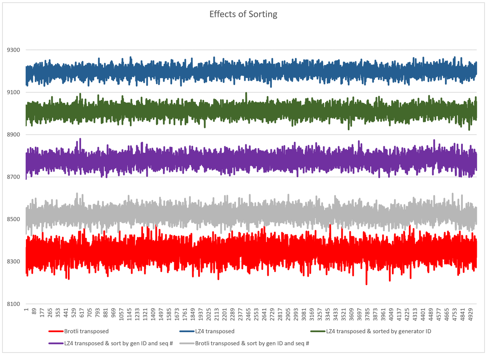

# SnowflakeCompress

This is a test harness to facilitate experimenting with compressing blocks of [snowflake IDs](https://en.wikipedia.org/wiki/Snowflake_ID). It creates a block of snowflake IDs, runs it through various processing pipelines, and outputs a CSV containing the size of the resulting byte block.

An [example results file](docs/results-3gen.xlsx) is included in this repository, along with some charts, to demonstrate the effectiveness of preconditioning the data before compressing it.

## Pipelines

As written, the test harness will compare the [Zlib](https://en.wikipedia.org/wiki/Zlib), [Snappy](https://en.wikipedia.org/wiki/Snappy_(compression%29), [LZ4](https://en.wikipedia.org/wiki/LZ4_(compression_algorithm%29), and [Brotli](https://en.wikipedia.org/wiki/Brotli) compressors against each other.
 
Some of the defined pipelines use a bitwise transposition (similar to [BitShuffle](https://github.com/kiyo-masui/bitshuffle) except performed over the entire block of IDs rather than on 8K chunks) to improve compressibility. When you consider each bit in an ID value, there tends to be a high degree of coherence across all of the IDs in a block. The reasons for this:

* Timestamps within the defined epoch, even at millisecond resolution, will still have many common bits, when the ID values are sorted.
* In practice, the number of ID generators in use for a production system tends to be low, so most generated IDs will have similar values here.
* Similarly, unless a production system is generating IDs at an extremely high rate, most sequence numbers in the generated IDs will fall into one of a very small number of values.

Apart from sorting on the entire ID value, and performing the bitwise transpose, this harness also demonstrates the effectiveness of bucketing IDs by their generator ID and sequence number. When all of this is performed, the performance-oriented LZ4 algorithm produces data whose size is within a couple of percentage points of what is produced by the comparatively slower Brotli algorithm.

These results suggest that, if you're transmitting large blocks of snowflake IDs, and want to use a performance-oriented compression algorithm like LZ4, preconditioning your data can give you compressed sizes comparable to the best general-purpose compressors.

## Configuration

The tuning parameters for the program are at the top of `Program.fs`. You can modify the snowflake ID format, parameters relating to the generation of timestamps and sequence numbers, the number of ID generators to support, the number of IDs to generate for each trial, and the number of trials to run.

By changing the test pipelines at the bottom of the file, you can also experiment with other data transformations, to test their effectiveness.

## Running

    dotnet run

A `results.csv` file will be output in the current directory.

## Acknowledgments

This harness uses a number of excellent open source libraries, which greatly simplified the experiment setup.

### [IdGen](https://github.com/RobThree/IdGen)

    The MIT License (MIT)

    Copyright (c) 2015 Rob Janssen
    
    Permission is hereby granted, free of charge, to any person obtaining a copy
    of this software and associated documentation files (the "Software"), to deal
    in the Software without restriction, including without limitation the rights
    to use, copy, modify, merge, publish, distribute, sublicense, and/or sell
    copies of the Software, and to permit persons to whom the Software is
    furnished to do so, subject to the following conditions:
    
    The above copyright notice and this permission notice shall be included in all
    copies or substantial portions of the Software.
    
    THE SOFTWARE IS PROVIDED "AS IS", WITHOUT WARRANTY OF ANY KIND, EXPRESS OR
    IMPLIED, INCLUDING BUT NOT LIMITED TO THE WARRANTIES OF MERCHANTABILITY,
    FITNESS FOR A PARTICULAR PURPOSE AND NONINFRINGEMENT. IN NO EVENT SHALL THE
    AUTHORS OR COPYRIGHT HOLDERS BE LIABLE FOR ANY CLAIM, DAMAGES OR OTHER
    LIABILITY, WHETHER IN AN ACTION OF CONTRACT, TORT OR OTHERWISE, ARISING FROM,
    OUT OF OR IN CONNECTION WITH THE SOFTWARE OR THE USE OR OTHER DEALINGS IN THE
    SOFTWARE.

### [IronSnappy](https://github.com/aloneguid/IronSnappy)

### [K4os.Compression.LZ4](https://github.com/MiloszKrajewski/K4os.Compression.LZ4)

    MIT License
    
    Copyright (c) 2017 Milosz Krajewski
    
    Permission is hereby granted, free of charge, to any person obtaining a copy
    of this software and associated documentation files (the "Software"), to deal
    in the Software without restriction, including without limitation the rights
    to use, copy, modify, merge, publish, distribute, sublicense, and/or sell
    copies of the Software, and to permit persons to whom the Software is
    furnished to do so, subject to the following conditions:
    
    The above copyright notice and this permission notice shall be included in all
    copies or substantial portions of the Software.
    
    THE SOFTWARE IS PROVIDED "AS IS", WITHOUT WARRANTY OF ANY KIND, EXPRESS OR
    IMPLIED, INCLUDING BUT NOT LIMITED TO THE WARRANTIES OF MERCHANTABILITY,
    FITNESS FOR A PARTICULAR PURPOSE AND NONINFRINGEMENT. IN NO EVENT SHALL THE
    AUTHORS OR COPYRIGHT HOLDERS BE LIABLE FOR ANY CLAIM, DAMAGES OR OTHER
    LIABILITY, WHETHER IN AN ACTION OF CONTRACT, TORT OR OTHERWISE, ARISING FROM,
    OUT OF OR IN CONNECTION WITH THE SOFTWARE OR THE USE OR OTHER DEALINGS IN THE
    SOFTWARE.
